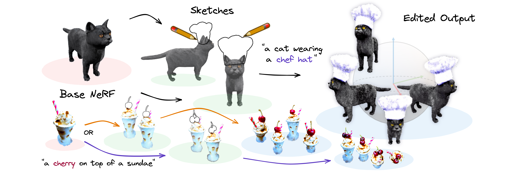
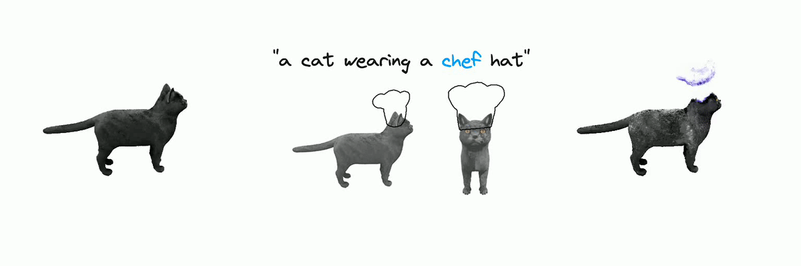

# SKED: Sketch-guided Text-based 3D Editing
<a href="https://arxiv.org/abs/2303.10735v3"></a>
<a href="https://sked-paper.github.io/"></a>

> **Aryan Mikaeili, Or Perel, Mehdi Safaee, Daniel Cohen-Or, Ali Mahdavi-Amiri**
> 
> Text-to-image diffusion models are gradually introduced into computer graphics, recently enabling the development of Text-to-3D pipelines in an open domain. However, for interactive editing purposes, local manipulations of content through a simplistic textual interface can be arduous. Incorporating user guided sketches with Text-to-image pipelines offers users more intuitive control. Still, as state-of-the-art Text-to-3D pipelines rely on optimizing Neural Radiance Fields (NeRF) through gradients from arbitrary rendering views, conditioning on sketches is not straightforward. In this paper, we present SKED, a technique for editing 3D shapes represented by NeRFs. Our technique utilizes as few as two guiding sketches from different views to alter an existing neural field. The edited region respects the prompt semantics through a pre-trained diffusion model. To ensure the generated output adheres to the provided sketches, we propose novel loss functions to generate the desired edits while preserving the density and radiance of the base instance. We demonstrate the effectiveness of our proposed method through several qualitative and quantitative experiments.

<p align="center">

</p>

# Description

Official implementation of the paper:  SKED: Sketch-guided Text-based 3D Editing

# Setup
To set up the environment, run the following commands:

```
conda env create -f sked_env.yml
conda activate sked_env
```

To build the cuda extensions please run the following command:

```
bash install_ext.sh
```

# Training base NeRFs

To train a base NeRF please save your data in the <a href="https://github.com/bmild/nerf">NeRF Blender</a> format in the data folder. The data folder should be as follows:

```
{code}/
{data}/
|-- {object name}
|   |-- train/
|   |   |-- {image_file_{0}}
|   |   |-- {image_file_{1}}
|   |   |-- ...
|   |   |-- {image_file_{n}}
|   |-- transforms_train.json

```

To train the base NeRF run the following commands:

```
cd code
python training/train.py --config_path ../configs/train_reconstruction.yaml --expname={object name}
```

Where object name is the name of the data folder.

# Training SKED

To create the sketch data please follow the demo data format in this repository.

To train SKED run the following commands:

```
cd code
python training/train.py --config_path ../configs/train_sked.yaml --checkpoint_path={path to base nerf checkpoint}
```

# Rendering a trained NeRF

To render and test the trained NeRFs you can run the following command:

```
cd code
python render_wrapper.py --config_path ../configs/render.yaml --exp_dir={path to experiment directory}
```

after running the code you can find a circular render of the object in the experiment directory.

By default every experiment is saved in the `./exps` directory. The directory structure is as follows:

```
{exp_dir}/
|-- sked/
|   |-- {exp_name}_{prompt}
|   |   |-- {date and time of the experiment}/
|   |   |   |-- checkpoints/
|   |   |   |   |-- {checkpoint files}
|   |   |   |-- plots/
|   |   |   |   |-- {validation prompts}
|-- instant_ngp/
|   |-- {exp_name}_{prompt}
|   |   |-- {date and time of the experiment}/
|   |   |   |-- checkpoints/
|   |   |   |   |-- {checkpoint files}
|   |   |   |-- plots/
|   |   |   |   |-- {validation prompts}

```

where `sked` contains the SKED experiments and `instant_ngp` contains the base NeRF models.

# Demo

The sketch data and base NeRF for the **cat and the chef hat** example is provided in this repo. To run the demo please run the following commands:

```
cd code
python training/train.py --config_path ../configs/train_sked.yaml 
python render_wrapper.py --config_path ../configs/render.yaml --exp_dir={../exps/{experiment dir}}
```
The output should be similar to the following:

<p align="center">

</p>

# Interactive UI
To be released
# Acknowledgements

This code is based on the earlier versions of the awesome <a href="https://github.com/ashawkey/stable-dreamfusion">Stable DreamFusion</a> codebase.

# Citation
To cite the paper please use the following bibtex:

``` 
@article{mikaeili2023sked,
    title={SKED: Sketch-guided Text-based 3D Editing},
    author={Aryan Mikaeili and Or Perel and Mehdi Safaee and Daniel Cohen-Or and Ali Mahdavi-Amiri},
    journal={ICCV},
    year={2023}
}
```